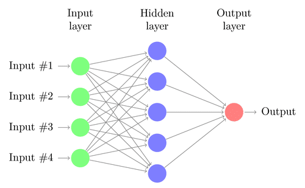

# Introduction to Neural Networks
Neural networks form the basis of deep learning, which algorithms are inspired by the structure of the human brain. They take in data as an input, train themselves to understand the patterns in that data and then predict outputs for a new set of similar data.

A neural network consists of several neurons and three layers. The input later, the output layer and the middle hidden layer. There are generally several hidden layers between the input and output layers. 

[Image Source](https://research.aimultiple.com/how-neural-networks-work/)

HELLO 

## How does a Neural Network Learn?
This can be broken into two processes. Forward propagation and back propagation.

### Forward Propagation
Flow of information from the input layer to the output layer. Neurons in the first layer connect to the next layer (first layer in the hidden layer) through channels. Each channel is assigned a numerical values called weights. The inputs are multiplied to the weights and their sum is sent as inputs to the hidden layer and each neuron in turn is associated to a numerical value called a bias. This bias is then added to the input sum. This input sum is then passed through to an activation function (a known non-linear function), which decides whether or not this neuron can contribute to the following layer. The output layer is a probability, where the neuron with the highest value determines what the output value is. 
- The weight of the neuron tells us how important it is.
- The bias allows the shifting function shift to the right or to the left.

### Back Propagation
Information here goes from the output layer to the hidden layer. The output layer is supposed to be the final destination of the data, so why do have back propagation? In back propagation, the neural network evaluates its own performance and checks whether it is right or wrong. If it is wrong, the network utilises something called a loss function to quantify the deviation from the expected output. We would the go backwards and adjust the initial weights and the biases so that the values are now adjusted to better fit the prediction model. 

### Steps to the Learning Algorithm
1. Initialse the weights and values of the neurons
2. Feed the input data to the network
3. Compare the predicted value with the expected value and calculate the loss
4. Perform back propagation to propagate this loss back through the network
5. Update parameters based on the loss
6. Iterate the previous steps until the loss is minimised

### Sources:
1. [FreeCodeCamp: Deep Learning Crash Course for Beginners](https://www.youtube.com/watch?v=VyWAvY2CF9c)

