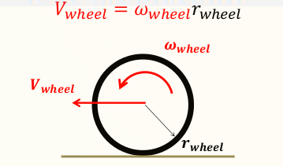
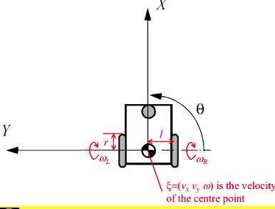

# Locomotion

### Case Study of the DAPAR Robotics Challenge

- Stability
  - Number and geometry of contact points
  - Centre of gravity
  - Static/dynamic stability
  - Inclination of terrain
- Characteristics of contact
  - Contact point/path size and shape
  - Angle of contact
  - Friction
- Types of environment
  - Structure
  - Medium (air, water etc)

## Wheeled Robots

- It is the most popular locomotion mechanism due to:

  - Good efficiency
  - simple mechanical implementation
  - Easy balance
- Four major wheel classes

  - Standard wheel: 2 DOF
  - Castor Wheel: 2 DOF
  - Swedish/Mecanum Wheel: 3 DOF
  - Ball/spherical Wheel: 3 DOF

### Motor Classification

- DC motors
  - Brushed Motors
  - Brushless motors
  - Servo motors
- AC Motors
  - Induction motors
  - Synchronous motors
  - Servo motors
  - Stepper Motor

### Three fundamental characteristics for locomotion

- Stability
  - Number of wheels and the configuration
- Maneuverability
  - How easily the robot can be manoeuvered
- Controllability
  - How easily the robot can be controlled
  - Generally inverse to maneuverability

---

## Kinematics for Differential Drive Robot

#### Wheel Rotation and Velocity Relationship

Assuming no Slippage

$V_{wheel}$ = $\omega_{wheel}$*$r_{wheel}$

$\xi$ = $\xi_R$ + $\xi_L$

$\begin{bmatrix}v_x \\ v_y \\ \omega\end{bmatrix}$ = $\begin{bmatrix} v_{x}^R \\ v_{y}^R \\ \omega^R  \end{bmatrix}$ + $\begin{bmatrix} v_{x}^L \\ v_{y}^L \\ \omega^L \end{bmatrix}$

$\begin{bmatrix}v_x \\ v_y \\ \omega\end{bmatrix}$ = $\begin{bmatrix}\frac{r\omega_R}{2} \\ 0 \\ \frac{r\omega_R}{2l}\end{bmatrix}$ + $\begin{bmatrix}\frac{r\omega_L}{2} \\ 0 \\ -\frac{r\omega_L}{2l}\end{bmatrix}$ = $\begin{bmatrix}\frac{r\omega_R + r\omega_L}{2} \\ 0 \\ \frac{r\omega_R - r\omega_L}{2l}\end{bmatrix}$

# Perception

## Encoders

- Incremental Encoders

  - https://www.youtube.com/watch?v=zzHcsJDV3_o
  - Can be used in position and motor feedback applications
  - They use disks, including equally spaced gaps.
  - A light emitting diode is on one side of the disk and there is a reciever on the other side of the disk. The light passes through the gap at every interval and it hits the reciever.
  - The encoder then generates a sequence of pulses and the output is measured in pulses per second.
  - This can be used to determine the position or the rotational speed.
- Absolute Enoders

  - https://www.youtube.com/watch?v=yOmYCh_i_JI
  - These are also called shaft encoders
  - This usually has a coded disk.
  - They also require a decoder
  - The advantage is that each angular position of the encoder can be read at any time.

## Inertial Sensors

- Accelerometers
  - https://www.youtube.com/watch?v=eqZgxR6eRjo&t=110s
  - It measures acceleration by measuring change in capacitance.
  - It has a mass attached to a spring which is confined to move along one direction and it has some fixed outer plates.
  - When an acceleration is applied, the mass will move and the distance between the mass and the fixed plates will change. This will also change the capacitance between the two plates.
  - This capacitane will be measured, processed and it will correspond to a particular acceleration value
- Gyroscopes
  - Measures Angular rate using the coriolis effect
  - When a mass is moving in a particular direction with a particular velocity and when an external angluar rate is applied, a force will occur perpendicular to the mass.
  - This displacement will cause a change in capacitance and it corresponds to a particular angular rate.
- Magnetometer
  - Uses the hall effect
  - Suppose we have a conductive plate and pass some current through it.
  - If we bring a magnet to it and distrub the current.
  - We can then measure the current through the metal plate and we can measure the magnetic field.
